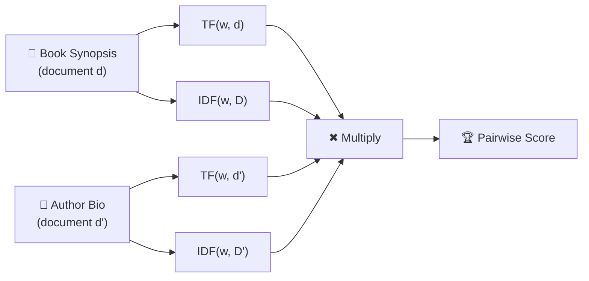
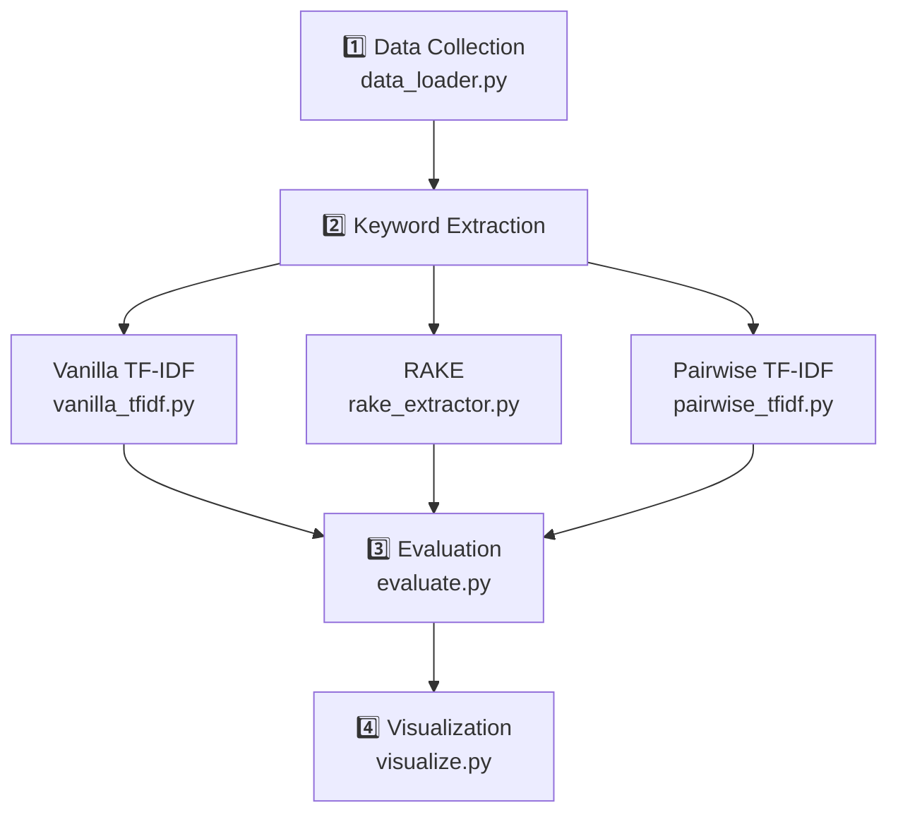

# 📚 Pairwise TF-IDF Knowledge Extraction

A keyword extraction system that finds words shared **meaningfully between two paired documents** — a book synopsis paired with its author's biography — instead of just scoring words within one document like standard TF-IDF.

Based on the **UAFGK method** (Applied Soft Computing, 2026).

---

## 💡 The Idea

Traditional keyword extraction looks at **one document at a time**. But what if two documents are related — like a book and its author's bio? Words that are important in **both** documents are more likely to be truly meaningful keywords.

**Pairwise TF-IDF** multiplies the TF-IDF scores from both documents together:

```
Pairwise-TF-IDF(w) = TF(w,d) × IDF(w,D) × TF(w,d') × IDF(w,D')
```

| Symbol | Meaning |
|--------|---------|
| `d` | A single book synopsis |
| `D` | Corpus of **all** book synopses |
| `d'` | The paired author biography |
| `D'` | Corpus of **all** author biographies |
| `TF(w,d)` | How often word `w` appears in document `d` |
| `IDF(w,D)` | How distinctive word `w` is across corpus `D` |

> **Key insight**: If a word is missing from either document, its TF in that document is **0**, making the entire product **0**. Only words that matter in **both** documents survive.

---

## 🔬 How It Works



---

## 🏗️ Project Pipeline



---

## 📁 Project Structure

```
Pairwise-TF-IDF-Knowledge-Extraction/
│
├── data/
│   ├── raw/                  # Goodreads books CSV goes here
│   └── processed/            # Cleaned book–author pairs (auto-generated)
│
├── src/
│   ├── data_loader.py        # Step 1: Load books + fetch Wikipedia bios
│   ├── vanilla_tfidf.py      # Step 2a: Standard TF-IDF baseline
│   ├── rake_extractor.py     # Step 2b: RAKE baseline
│   ├── pairwise_tfidf.py     # Step 2c: ⭐ Pairwise TF-IDF (main method)
│   ├── evaluate.py           # Step 3: Quantitative comparison
│   └── visualize.py          # Step 4: Word clouds + bar charts
│
├── notebooks/
│   └── experiments.ipynb     # Interactive experiments
│
├── results/
│   └── keyword_outputs/      # Saved keyword CSVs per method
│
├── requirements.txt
└── README.md
```

---

## 🚀 Quick Start

### 1. Clone & Install

```bash
git clone https://github.com/Ahmedaboenaba/Pairwise-TF-IDF-Knowledge-Extraction.git
cd Pairwise-TF-IDF-Knowledge-Extraction
pip install -r requirements.txt
```

### 2. Get the Dataset

Download the [Goodreads Books CSV](https://www.kaggle.com/datasets/jealousleopard/goodreadsbooks) from Kaggle and place it at:

```
data/raw/books.csv
```

### 3. Run the Pipeline

Run each step in order from the **project root** directory:

```bash
# Step 1: Collect data (loads books + fetches author bios from Wikipedia)
python src/data_loader.py

# Step 2: Run all 3 keyword extraction methods
python src/vanilla_tfidf.py
python src/rake_extractor.py
python src/pairwise_tfidf.py

# Step 3: Evaluate and compare the methods
python src/evaluate.py

# Step 4: Generate visualizations
python src/visualize.py
```

> **Note:** After running `evaluate.py`, copy the metric scores it prints into the `METRICS` dict at the top of `visualize.py`, then re-run it.

---

## 📊 Methods Compared

| Method | How It Works | Scope |
|--------|-------------|-------|
| **Vanilla TF-IDF** | Scores words within a single document corpus using sklearn | One document at a time |
| **RAKE** | Extracts key phrases based on word co-occurrence patterns | One document at a time |
| **Pairwise TF-IDF** ⭐ | Multiplies TF-IDF scores from **both** paired documents | Two documents together |

---

## 📈 Evaluation Metrics

| Metric | What It Measures | Why It Matters |
|--------|-----------------|----------------|
| **Lexical Overlap** | % of extracted keywords found in **both** the synopsis AND the bio | Tests if keywords are truly shared between paired documents |
| **Keyword Diversity** | Average number of unique keywords per book | Tests if the method avoids repeating generic words |

Pairwise TF-IDF is expected to score **highest on Lexical Overlap** because the formula inherently filters for words present in both documents.

---

## 📦 Output Files

After running the full pipeline, you'll find:

| File | Description |
|------|-------------|
| `data/processed/pairs.csv` | Cleaned book–author paired dataset |
| `results/keyword_outputs/vanilla_tfidf_keywords.csv` | Keywords from Vanilla TF-IDF |
| `results/keyword_outputs/rake_keywords.csv` | Keywords from RAKE |
| `results/keyword_outputs/pairwise_tfidf_keywords.csv` | Keywords from Pairwise TF-IDF |
| `results/comparison_table.csv` | Side-by-side comparison of all methods |
| `results/wordcloud_*.png` | Word cloud per method |
| `results/top_keywords_comparison.png` | Top 15 keywords bar chart |
| `results/metrics_comparison.png` | Evaluation metrics bar chart |

---

## 🛠️ Tech Stack

- **Python 3.8+**
- **pandas** — data handling
- **scikit-learn** — TF-IDF vectorizer (baseline)
- **nltk** — stopwords and text preprocessing
- **rake-nltk** — RAKE keyword extraction
- **wikipedia** — fetching author biographies
- **matplotlib / wordcloud** — visualizations
- **tqdm** — progress bars

---

## 📝 Reference

This project implements the pairwise keyword extraction method described in:

> **UAFGK: A Unified Approach for Generating Keywords from Paired Documents**
> *Applied Soft Computing*, 2026.

---

## 👤 Author

Ahmed Abo Enaba — Pre M.Sc. Machine Learning Practical, Semester 2

---

## 📄 License

This project is for academic/educational purposes.
